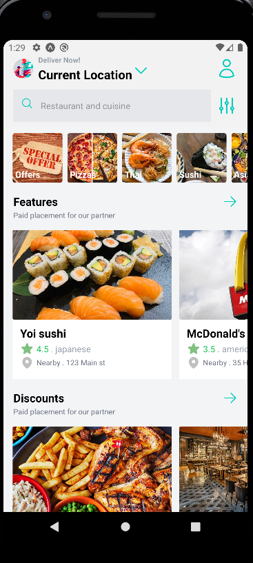

# Deliveroo Clone with React Native

### Guides
To install all the dependancies, run 
```
yarn install
```

To run the app with Android Emulator, run
```
npm run android
```

To connect to localhost backend, navigate to the __adb.exe__ (you must have [Android Studio](https://developer.android.com/studio) installed on your machine) by path: ```~\AppData\Local\Android\Sdk\platform-tools```, then map the backend localhost's __[PORT]__ to the emulator's one by command:
```
./adb reverse tcp:[PORT] tcp:[PORT]
```

### Showcase
<figure>
<center>



</center>
</figure>